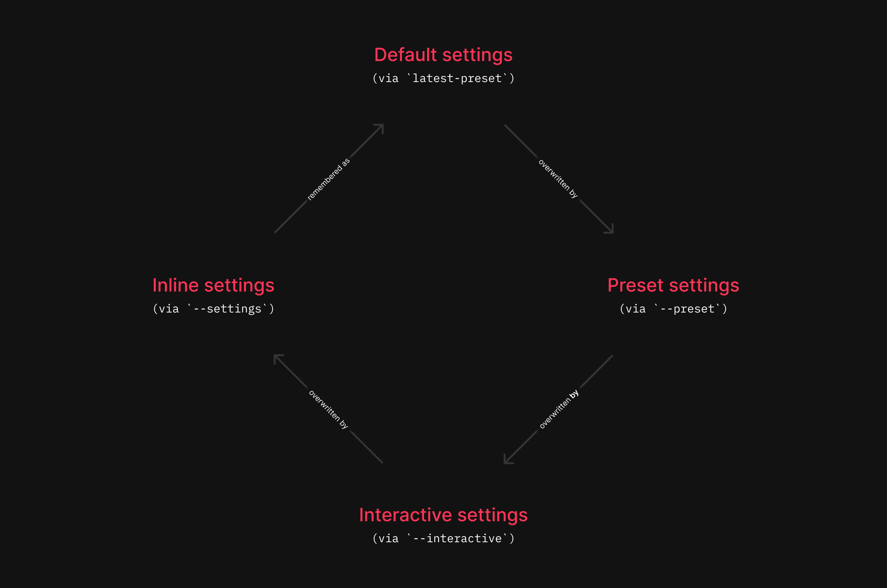
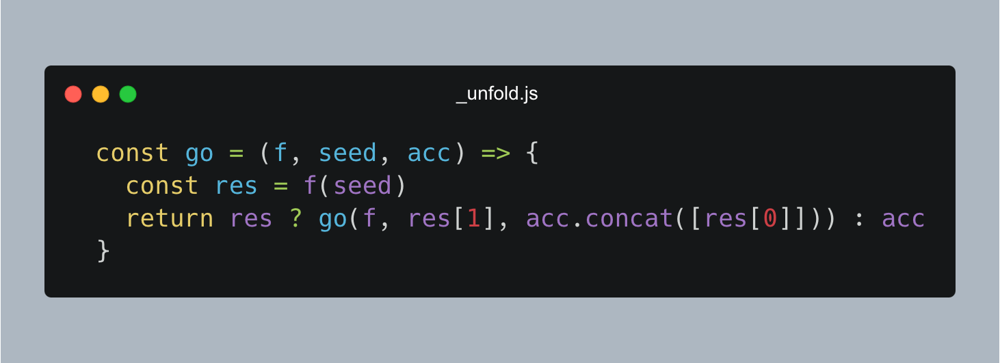

# [](https://github.com/mixn/carbon-now-cli)

> 🎨 Beautiful images of your code — from right inside your terminal.

[](https://github.com/mixn/carbon-now-cli/actions) [](https://github.com/prettier/prettier) [](https://github.com/sindresorhus/awesome-nodejs#command-line-apps) [](https://twitter.com/mixn) [](https://github.com/mixn/carbon-now-cli/stargazers/) [](https://github.com/mixn/carbon-now-cli/graphs/commit-activity) [](https://img.shields.io/node/v/carbon-now-cli) [](https://github.com/mixn/carbon-now-cli/blob/master/license)

## Table of Contents

- [Description](#description)
- [Features](#features)
- [Installation](#installation)
- [Usage](#usage)
- [Presets](#presets)
- [License](#license)
- [Examples](#examples)

## Description

[carbon.now.sh](https://carbon.now.sh/) is an excellent tool that lets you generate beautiful images of your source code through an intuitive UI while allowing you to customize aspects like fonts, themes, window controls, and &amp; more.

`carbon-now-cli` gives you the full power of Carbon — right at your fingertips, **inside the terminal**.

Generate beautiful images from a source file, or sections of a source file, by running a single command.

Want to customize **everything** before generating the image? Run it in ⚡️ ***interactive mode.*** ⚡️ 😎


## Features

- 🖼 Downloads the real, high-quality image (no DOM screenshots)
- ✨ Detects file type automatically
- 🗂 Supports all languages &amp; [covers extra ground](https://github.com/mixn/carbon-now-cli/blob/master/src/helpers/cli/extensions-map.helper.ts)
- ⚡️ [Interactive mode](#fully-customized) via `--interactive`
- 🎒 [Presets](#presets) to save and re-use your favorite settings
- 🖱 [Selective processing](#selective) via `--start` and `--end`
- 📎 [Copies image to clipboard](#copying-to-clipboard) via `--to-clipboard` (cross-OS 😱)
- 📚 Accepts [file, `stdin`, or clipboard content](#input-sources) as input
- 🖋️ Supports [custom theme colors](#custom-theme-colors)
- 🥞 Supports concurrency for easier batch processing
- 👀 Saves to [given location](#full-example) or [opens in browser](#full-example) for manual finish
- 🐶 Displays image directly in supported terminals
- 🌈 Supports different export types (`png`, `svg`)
- 📏 Supports different resolutions (`1x`, `2x`, `4x`)
- ⏱ Reports each step and therefore shortens the wait
- ✅ Heavily tested
- ⛏ Actively maintained
- 🧺 …[and](https://github.com/mixn/carbon-now-cli/issues/50) [more](https://github.com/mixn/carbon-now-cli/issues/70)!

## Installation

### Bun

```
bun i -g carbon-now-cli
```

### pnpm

```
pnpm i -g carbon-now-cli
```

### npx

```
npx carbon-now-cli <file>
```

### npm

```
npm i -g carbon-now-cli
```

### yarn

```
yarn global add carbon-now-cli
```

#### Requirements

[](https://img.shields.io/node/v/carbon-now-cli)

## Usage

```
Beautiful images of your code — from right inside your terminal.

Usage
  $ carbon-now <file>
  $ pbpaste | carbon-now
  $ carbon-now --from-clipboard

Options
  --start, -s          Starting line of input
  --end, -e            Ending line of input
  --interactive, -i    Interactive mode
  --preset, -p         Apply an existing preset
  --save-to            Image save location, default: cwd
  --save-as            Image name without extension, default: original-hash
  --from-clipboard     Read input from clipboard instead of file
  --to-clipboard       Copy image to clipboard instead of saving
  --open-in-browser    Open in browser instead of saving
  --config             Use a different, local config (read-only)
  --settings           Override specific settings for this run
  --disable-headless   Run Playwright in headful mode
  --engine             Use different rendering engine, default: `chromium`
                       Options: `chromium`, `firefox`, `webkit`
  --skip-display       Don’t display the image in the terminal

Examples
  See: https://github.com/mixn/carbon-now-cli#examples
```

## Presets

### Creating a preset

However you use the `carbon-now` command, a `~/.carbon-now.json` config will be created for you.

Presets live inside your `~/.carbon-now.json` config and are made up of [available settings](#settings). You can create presets manually, or automatically by running `carbon-now` with `--interactive`. You’ll then be asked the following two questions last:


Answering with yes and naming the preset (in this case `presentation`) will result in the preset being saved to `~/.carbon-now.json`. In this particular case, `~/.carbon-now.json` will look like so:

```ts
{
  "latest-preset": {
    // Equal to `presentation` below
  },
  "presentation": {
    "theme": "base16-light",
    "backgroundColor": "white",
    "windowTheme": "none",
    "windowControls": true,
    "fontFamily": "Space Mono",
    "fontSize": "18px",
    "lineNumbers": false,
    "firstLineNumber": 1,
    "selectedLines": "*",
    "dropShadow": false,
    "dropShadowOffsetY": "20px",
    "dropShadowBlurRadius": "68px",
    "widthAdjustment": true,
    "width": "20000px",
    "lineHeight": "140%",
    "paddingVertical": "35px",
    "paddingHorizontal": "35px",
    "squaredImage": false,
    "watermark": false,
    "exportSize": "2x",
    "type": "png"
  }
}
```

`latest-preset` will be overwritten after each run. `presentation` is meant to stay until you eventually decide to delete it manually.

### Using a saved preset

Re-using presets is as easy and straight-forward as:

```
carbon-now unfold.js -p <name-of-preset>
```

If a given preset or `~/.carbon-now.json` doesn’t exist, `carbon-now-cli` will fall back to the [default settings](https://github.com/mixn/carbon-now-cli/blob/master/src/config/cli/default-settings.config.ts) and be [smart about the rest](#re-using-settings).

Taken the `presentation` preset we have created above, all we have to do is:

```
carbon-now unfold.js -p presentation
```

**Result**:


### Settings

```ts
interface CarbonCLIPresetInterface {
  backgroundColor: string;
  dropShadow: boolean;
  dropShadowBlurRadius: string;
  dropShadowOffsetY: string;
  exportSize: '1x' | '2x' | '4x';
  firstLineNumber: number;
  fontFamily: CarbonFontFamilyType;
  fontSize: string;
  lineHeight: string;
  lineNumbers: boolean;
  paddingHorizontal: string;
  paddingVertical: string;
  selectedLines: string; // All: "*"; Lines 3-6: "3,4,5,6", etc.
  squaredImage: boolean;
  theme: CarbonThemeType;
  type: 'png' | 'svg';
  watermark: boolean;
  widthAdjustment: boolean;
  windowControls: boolean;
  windowTheme: 'none' | 'sharp' | 'bw';
  custom?: CarbonThemeHighlightsInterface;
  width?: string;
  // Below are detected automatically, and not persisted as keys
  language?: string;
  titleBar?: string;
}
```

`CarbonFontFamilyType`, `CarbonThemeType` & `CarbonThemeHighlightsInterface` can be found [here](https://github.com/mixn/carbon-now-cli/blob/master/src/types/carbon/global.d.ts).

### Re-using settings

#### *It just works.* ™

`carbon-now` will always be smart about re-using settings, no matter how you have previously interacted with it.



<!--
Currently, the precedence of settings is as follows:

[Default settings](https://github.com/mixn/carbon-now-cli/blob/master/src/config/cli/default-settings.config.ts) `<` Preset `<` `--interactive` `<` `--settings`
-->

### Custom theme colors

From `v2.0` onwards, `carbon-now-cli` supports the ability to define custom theme colors, i.e., what color e.g., `variable`s, `operator`s, `attribute`s, etc. should have, allowing you to have complete control over how things look to the smallest detail.

As briefly touched upon in the [settings section](#settings), you have to provide a key called `custom` inside one of your presets that complies to the following type:

```ts
interface CarbonThemeHighlightsInterface {
  background?: string;
  text?: string;
  variable?: string;
  variable2?: string;
  variable3?: string;
  attribute?: string;
  definition?: string;
  keyword?: string;
  operator?: string;
  property?: string;
  number?: string;
  string?: string;
  comment?: string;
  meta?: string;
  tag?: string;
}
```

Here’s an example `~/.carbon-now.json` config that has one preset `hacker`, which makes use of custom theme colors:

```ts
{
  "hacker": {
    "backgroundColor": "rgba(0, 255, 0, 1)",
    "windowTheme": "bw",
    "windowControls": true,
    "fontFamily": "Anonymous Pro",
    "fontSize": "18px",
    "lineNumbers": false,
    "firstLineNumber": 1,
    "dropShadow": false,
    "selectedLines": "*",
    "dropShadowOffsetY": "20px",
    "dropShadowBlurRadius": "68px",
    "widthAdjustment": true,
    "lineHeight": "133%",
    "paddingVertical": "30px",
    "paddingHorizontal": "30px",
    "squaredImage": false,
    "watermark": false,
    "exportSize": "2x",
    "type": "png",
    "custom": {
      "background": "rgba(0, 0, 0, 1)",
      "text": "rgba(0, 255, 0, 1)",
      "variable": "rgba(0, 255, 0, 1)",
      "variable2": "rgba(0, 255, 0, 1)",
      "attribute": "rgba(0, 255, 0, 1)",
      "definition": "rgba(0, 255, 0, 1)",
      "keyword": "rgba(0, 255, 0, 1)",
      "operator": "rgba(0, 255, 0, 1)",
      "property": "rgba(0, 255, 0, 1)",
      "number": "rgba(0, 255, 0, 1)",
      "string": "rgba(0, 255, 0, 1)",
      "comment": "rgba(0, 255, 0, 1)",
      "meta": "rgba(0, 255, 0, 1)",
      "tag": "rgba(0, 255, 0, 1)"
    }
  }
}
```

```
carbon-now unfold.js -p hacker
```

### Result:


### Limitations

Please note that custom theme colors won’t be applied with `--open-in-browser` because they aren’t query string parameters but instead communicated to Carbon via `localStorage`, which is solely set inside the Playwright instance.

## Local configs

It is possible to use local configuration files via the `--config` flag.

This is convenient if you’re using `carbon-now-cli` via a script and would like to share presets among the users of your project.

```
carbon-now unfold.js --config local-config.json -p dark
```

Local configs differ from `~/.carbon-now.json` in the sense that they behave in a **read-only** manner, hence:

1. `local-config.json` won’t be created if it doesn’t exist
2. `latest-preset` will not be written to `local-config.json`

## Examples

Assuming you have a file `unfold.js` with this content

```javascript
// Example from https://carbon.now.sh/
const unfold = (f, seed) => {
  const go = (f, seed, acc) => {
    const res = f(seed)
    return res ? go(f, res[1], acc.concat([res[0]])) : acc
  }
  return go(f, seed, [])
};
```

and you’d like to make a beautiful image out of it. You could approach this in several ways.

### Basic

```
carbon-now unfold.js
```

Takes the entire source of `unfold.js`, uses [Carbon’s default settings](https://github.com/mixn/carbon-now-cli/blob/master/src/config/cli/default-settings.config.ts), and saves as `.png` into your `cwd`.

**Result**:


### Fully customized

```
carbon-now unfold.js --interactive
```

Launches an interactive mode, prompting questions, allowing you to customize every aspect of Carbon, like syntax theme, `font-family`, `padding`, window controls, etc.

Given this input…


…the result will look like so 😍:


If you’re unsure what each question, e.g., “Make squared image?” refers to, simply confirm by hitting **Enter** — it will default to a sensible, nice-looking thing.

If needed, you can always check the [all available settings](#settings).

**Note**: `carbon-now` will be smart enough to re-use your last used settings instead of the default ones. 🤓

### Selective

```
carbon-now unfold.js --start 3 --end 6
```

Reads and creates an image based on lines `3` to `6` instead of the entire file. Will throw an error if `-s` > `-e`.

Selective processing can of course be combined with interactive mode, as with any other option. 😊

#### Result:



### Copying to clipboard


It is [sometimes desired to just put the image in the clipboard](https://github.com/mixn/carbon-now-cli/issues/3#issue-339776815), so that it can be instantly pasted into other apps (like Keynote 💻 or Twitter 🐦). This is what the `--to-clipboard` flag is for.

```
carbon-now unfold.js --to-clipboard
```

will copy the image to clipboard instead of downloading it to a given directory.

Please be aware that this requires some binaries to be present on certain OS.

#### Linux

[`xclip`](https://linux.die.net/man/1/xclip) is required. You can install it via

```
sudo apt-get install xclip
```

#### Windows &amp; macOS

*It just works.* ™

### Input Sources

You’ll sometimes find yourself in a situation where you’d like to create an image based on a piece of code, but don’t want to create a file for it first.

In addition to files, `carbon-now-cli` therefore also accepts input coming from `stdin` or the clipboard.

#### `stdin`

```
pbpaste | carbon-now
echo '<h1>Hi</h1>' | carbon-now
```

#### Clipboard

```
carbon-now --from-clipboard
```

### Full Example

For demonstration purposes, here is an example using most options.

```
carbon-now unfold.js --start 3 --end 6 --save-to ~/Desktop --save-as example-23 --interactive
```

This saves a beautiful image of lines `3` to `6` to `~/Desktop/example-23.png`, after accepting custom wishes via interactive mode.

If you’re unsure how exactly the image will turn out, you can always use `--open-in-browser`.

```
carbon-now unfold.js --start 3 --end 6 --interactive --open-in-browser
```

This will open the image in the browser for final touches, instead of saving it immediately. 😌


## License

MIT © [Miloš Sutanovac](https://twitter.com/mixn)
